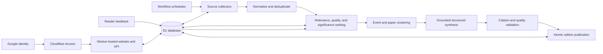

# Personal Morning Briefing — Design Specification

**Status:** Approved design  
**Date:** July 29, 2026  
**Working name:** Optimist Briefing  
**Primary URL:** `optimistindustries.com`

## 1. Purpose

Optimist Briefing is a private daily website that publishes a high-quality,
source-grounded synthesis of research and news by 6:00 a.m. Eastern every day.
It is designed for one reader and a 20–30 minute morning reading session, with a
three-minute top layer for rushed mornings.

The product should reduce information overload rather than reproduce it. Its
primary job is to find the small number of items worth the reader's attention,
explain why they matter, expose uncertainty and limitations, and provide direct
links to original material.

## 2. Success Criteria

The first production release is successful when it:

1. Publishes one complete or explicitly labeled partial edition by 6:00 a.m.
   Eastern every day.
2. Requires an approved Google account before any briefing or archive content is
   accessible.
3. Produces a useful three-minute overview and a complete edition readable in
   approximately 20–30 minutes.
4. Selects research that strongly matches the reader's interests while filtering
   out weak, incremental, or poorly supported work.
5. Clusters duplicate reporting into developments rather than presenting a list
   of repetitive links.
6. Links every summarized item to its underlying sources and distinguishes
   facts, analysis, opinion, research claims, and forecast signals.
7. Gives the reader transparent selection reasons and editable feedback controls.
8. Keeps normal monthly infrastructure and AI costs at or below $30.
9. Preserves the previous complete edition whenever a new run is delayed or
   fails.

## 3. Reader Profile

### Research interests

**AI safety, alignment, and interpretability**

- Internal representations of concepts and how they evolve during training
- Theoretical models of emergent phenomena in learning
- Theoretical models of scaling
- Capability elicitation
- AI safety via debate
- Game-theoretic models of multi-agent behavior

**Oversight and governance**

- Cryptographic verification of model training and inference
- Data provenance
- Secure evaluation frameworks

**Secure computation and machine learning**

- Fully homomorphic encryption
- Multiparty computation
- Zero-knowledge proofs
- Functional encryption
- Applications of those techniques to ML

### Preferred research signals

Work associated with Stanford, Berkeley, Harvard, MIT, Carnegie Mellon, Penn,
Johns Hopkins, UT Austin, Georgia Tech, Google, Google DeepMind, Anthropic,
OpenAI, and similarly strong groups receives a modest positive signal. This is a
capped boost, not an inclusion requirement. Strong work from unfamiliar groups
must remain eligible, and weak work from preferred groups must not be promoted
solely because of affiliation.

### News preferences

- Relatively neutral, direct reporting
- Reuters, Associated Press, NPR, and The Economist as preferred sources
- Monitoring the Situation as a tech/news discovery and aggregation signal
- Polymarket as a signal of changing expectations, never as factual reporting
- DMV regional news
- A visibly separate Baltimore local-news subsection

## 4. Scope

### Included in the first production release

- Daily private briefing
- Google-authenticated access
- Today's edition and searchable edition archive
- Research, world news, technology news, AI policy, DMV, Baltimore, and forecast
  signal sections
- Source ingestion, normalization, duplicate detection, ranking, clustering,
  summarization, validation, and publishing
- Transparent "why selected" explanations
- Save, more-like-this, and less-like-this feedback
- Editable topic and source preferences
- Run-status and cost-status page
- Manual regeneration of a failed or partial edition
- Responsive desktop and mobile layouts

### Explicit non-goals for the first release

- A public or multi-user publication
- Native mobile applications
- Email delivery
- Social features, comments, or sharing
- Automated trading or personalized financial advice
- Bypassing paywalls or retaining a private mirror of copyrighted articles
- Replacing direct reading of papers or primary documents
- Fully autonomous rewriting of the reader's preference profile

The architecture leaves room for later sections and email delivery without
requiring them now.

## 5. System Architecture

The domain remains registered at GoDaddy. Authoritative DNS moves to Cloudflare
so Cloudflare can host and protect the application at the apex domain. Moving
DNS does not transfer domain registration.

### Cloudflare components

- **Worker with static assets:** serves the dashboard, archive, preferences, and
  JSON API.
- **D1:** stores source metadata, candidates, scores, clusters, summaries,
  editions, preferences, feedback, and workflow state.
- **Workflows:** runs the durable multi-step daily editorial pipeline with
  retries and resumability.
- **Access:** places Google authentication and an email allowlist in front of the
  entire application.

The application uses provider adapters for embeddings and language-model calls.
The first implementation may use one model provider, but no domain logic may
depend directly on a provider-specific response shape.

## 6. Schedule and Publication Semantics

Workflow schedules fire at 08:30, 09:30, and 10:30 UTC. A coordinator converts
the trigger time to `America/New_York`, exits outside the 4:00–5:50 a.m. local
window, and uses the local edition date as an idempotency key. This handles
daylight-saving transitions without manual cron changes.

- The first valid trigger creates the day's run.
- A later valid trigger exits if the edition has already published.
- A later valid trigger resumes a retryable incomplete run.
- The target publication time is 5:45 a.m. Eastern.
- The hard availability goal is 6:00 a.m. Eastern.
- Publication occurs in one database transaction: edition entries are prepared
  as a draft, validated, and then the edition status changes to `published`.
- The home page resolves to the newest published edition. It never renders an
  incomplete draft.

## 7. Source Strategy

### Research discovery

The system retrieves new and recently updated work from:

- arXiv's public API and RSS feeds
- Semantic Scholar for paper metadata, related work, citations, influential
  citations, and recommendation signals
- OpenAlex for authors, institutions, topics, and bibliographic enrichment
- Official research blogs and feeds from relevant universities and laboratories
- Selected independent research blogs that summarize or critique results

The daily candidate window is the previous 36 hours. A rolling seven-day scan
allows an important paper or blog post to surface after initial discussion
provides stronger quality evidence.

The site includes arXiv's requested acknowledgement:

> Thank you to arXiv for use of its open access interoperability.

Full paper text is retrieved only when access and terms permit it. Otherwise,
ranking and summarization use metadata, abstract, legitimate excerpts, and
accessible discussion. The system must never infer that it read a full paper
when it only received the abstract.

### News discovery

Source roles are explicit:

1. **Primary evidence:** legislation, regulations, agency notices, court
   documents, standards, company research releases, and other original records.
2. **Preferred reporting:** Reuters, AP, NPR, and other direct, comparatively
   neutral reporting.
3. **Local reporting:** WYPR, The Baltimore Banner, Baltimore Brew, WTOP,
   Maryland Matters, WAMU and other verified DMV or Baltimore outlets.
4. **Discovery and corroboration:** GDELT, source feeds, and search results.
5. **Attention and expectation signals:** Monitoring the Situation and
   Polymarket.

The Economist may contribute accessible headlines, metadata, and legitimately
available article content. The system does not circumvent its paywall.

Prediction-market questions, prices, and changes may influence the
"expectations changed" section or help discover a developing story. They do not
count as corroboration and cannot support factual claims.

### Source catalog

Sources live in editable database records with:

- canonical name and URL
- source type and section eligibility
- discovery mechanism
- reporting, primary-document, opinion, blog, or forecast label
- trust prior
- paywall and usage restrictions
- enabled state
- last successful fetch and health status

Adding a topic or source does not require a code deployment.

## 8. Editorial Pipeline

1. **Collect:** retrieve candidates and store immutable retrieval metadata.
2. **Normalize:** canonicalize URLs, timestamps, authors, institutions, and
   identifiers.
3. **Deduplicate:** merge exact duplicates and near-duplicate syndication.
4. **Enrich:** attach bibliographic, affiliation, topic, citation, source, and
   forecast metadata.
5. **Prefilter:** apply section rules, semantic similarity, source health,
   language, recency, and minimum-content checks.
6. **Score:** calculate transparent relevance, quality, significance, and
   diversity components.
7. **Cluster:** group news about the same underlying development and associate
   research posts with the papers they discuss.
8. **Shortlist:** enforce section budgets and source/topic diversity.
9. **Synthesize:** generate a structured summary from retrieved material only.
10. **Validate:** verify required fields, source links, claim evidence,
    attribution, uncertainty language, and duplicate coverage.
11. **Compose:** assemble the overview and section ordering.
12. **Publish:** atomically release the validated edition.

Language-model memory is never treated as a source. Generated summaries receive
source packets and return structured claims tied to source identifiers.

## 9. Research Ranking and Summary Rubric

The initial research selection score is:

| Component | Weight | Meaning |
|---|---:|---|
| Topical fit | 35% | Semantic match to the reader's research profile |
| Technical quality | 30% | Specific claims, suitable methods or arguments, evidence, controls, limitations, and reproducibility |
| Research signal | 15% | Authors, laboratory, institution, venue, and related-work history |
| Novelty | 10% | Distinct contribution relative to recent related work |
| Serious attention | 10% | Expert discussion, follow-on work, citations, or influential-citation signals |

Rules prevent common distortions:

- Affiliation contributes no more than its 15% component.
- Missing citation data is neutral for newly released work, not negative.
- Popularity cannot compensate for low technical-quality or topical-fit scores.
- The shortlist applies topic diversity so one fashionable subtopic cannot
  consume the entire section.
- The stored score contains component values and human-readable selection
  reasons.

Every featured-paper summary answers:

1. What problem is addressed?
2. What is genuinely new?
3. What method, experiment, proof, or argument supports the contribution?
4. What is the strongest evidence?
5. What limitations or reasons for skepticism matter?
6. Why is the work relevant to the reader?
7. Was the full paper, abstract only, or a secondary discussion available?

## 10. News Ranking and Synthesis

News selection considers public importance, personal relevance, source quality,
cross-source corroboration, recency, geographic fit, and novelty relative to
previous editions. Raw publication volume and sensational wording are not
positive signals.

Each news cluster contains:

- a neutral headline
- what happened
- why it matters
- what remains uncertain or disputed
- primary evidence when available
- representative reporting links
- source-role labels
- a confidence level based on evidence and corroboration

Reporting, analysis, and opinion remain visibly distinct. Conflicting credible
accounts are summarized as disagreement rather than forced into false consensus.

## 11. Edition Composition

### Morning brief — 3–5 minutes

- Six to eight consequential developments selected across all sections
- Two sentences per development
- Links to the corresponding detailed item

### Research — 8–10 minutes

- Three featured papers with full structured summaries
- Four to six shorter "on the radar" paper or research-blog notes
- Related blog commentary attached to its paper when applicable

### News — 10–15 minutes

- World: two to four developments
- Technology: two to four developments
- AI policy: two to four developments
- DMV and Baltimore: three to five developments, with Baltimore visibly
  separated

### Forecast signals — 1–2 minutes

- A small number of material expectation changes
- Market name, current probability, change, liquidity/context when available,
  and resolution source
- An explicit statement that market prices are forecasts, not facts

Section limits are budgets, not quotas. A section may be shorter when the
available material does not clear its quality threshold.

## 12. Reader Experience

### Information architecture

- Today
- Research
- World
- Technology
- AI policy
- DMV + Baltimore
- Forecast signals
- Saved items
- Archive
- Preferences
- Run status

The page remembers reading position. Archive search covers title, topic, author,
institution, source, and summary text. Each card exposes direct source links,
selection reasons, and content provenance.

### Feedback

Available actions are:

- Save
- More like this
- Less like this
- Optional reason selection, such as topic, quality, source, depth, or
  repetitiveness

Feedback changes explicit preference weights. The preferences screen shows the
resulting topic and source adjustments and allows them to be edited or reset.
The system does not silently invent permanent interests from passive browsing
behavior.

### Visual identity

The approved interface is calm, editorial, and information-dense.

| Token | Initial value | Use |
|---|---|---|
| Burgundy | `#681F35` | Navigation, primary headings, primary actions |
| Muted rose | `#C98D98` | Secondary topic accents |
| Sage | `#89997D` | Research structure and navigation surfaces |
| Mustard | `#C69A2D` | Priority, active state, and small highlights |
| Warm cream | `#F7F0E5` | Main reading surface |

Body text must maintain WCAG AA contrast. Color never serves as the only carrier
of meaning. Desktop uses a compact sidebar; mobile collapses navigation and
keeps the briefing in one readable column.

## 13. Authentication and Security

- Cloudflare Access protects the entire Worker and requires Google
  authentication.
- The allow policy contains only explicitly approved email addresses.
- Access denies all users by default.
- Mutation and administrative endpoints validate the Access JWT and approved
  email claim in the Worker as defense in depth.
- Model, source, and service credentials are stored as encrypted Worker secrets.
- No credential or private briefing content is shipped in static assets or logs.
- State-changing requests require same-origin requests and CSRF protection.
- Administrative actions are recorded in an audit log.

## 14. Data Model

The core records are:

- `sources`: source catalog and health
- `items`: normalized papers, posts, documents, articles, and market signals
- `item_sources`: provenance and retrieval metadata
- `paper_metadata`: identifiers, authors, affiliations, topics, and citations
- `clusters`: related items representing one development or research result
- `scores`: component scores, model/rubric version, and selection reasons
- `summaries`: structured generated output and validation status
- `summary_claims`: claim text, supporting source IDs, and evidence excerpts
- `editions`: edition date, status, timestamps, reading-time estimate, and run ID
- `edition_entries`: ordered section membership
- `preferences`: explicit topic, source, institution, and section weights
- `feedback`: reader action, optional reason, and resulting adjustment
- `workflow_runs`: step state, attempts, failures, timing, and cost
- `audit_events`: administrative changes

Database migrations are versioned and applied before compatible application code
is promoted.

## 15. Retention and Copyright

- Published editions and included-item metadata are retained indefinitely unless
  the reader deletes them.
- Preferences, saves, and feedback are retained until explicitly reset or
  deleted.
- Unselected candidates expire after 90 days.
- Workflow details remain for 90 days; high-volume diagnostic logs expire after
  30 days.
- Copyrighted article body text is processed transiently and not retained as an
  article archive.
- Small evidence excerpts may be stored only to validate generated claims and
  remain associated with the source URL.
- Open-access paper text is retained only when its license and source terms allow
  it; the access level used by a summary is recorded.

## 16. Failure Handling and Observability

Each workflow step is idempotent and retryable.

- Source failure: retry with bounded backoff, record health, and continue when
  section coverage remains sufficient.
- Rate limit: honor server guidance, delay the affected step, and resume.
- Model failure: retry structured generation, then omit the item rather than
  publish malformed output.
- Validation failure: exclude the summary and record the exact failed rule.
- Database or publication failure: leave the draft unpublished and retain the
  previous edition.
- Insufficient coverage: publish an explicitly labeled partial edition only if
  the remaining content still provides useful value.

The run-status page reports step state, attempts, source failures, candidates
collected, items shortlisted, summaries rejected, publish time, and estimated AI
cost. Logs use correlation IDs and never include secrets or full private source
packets.

## 17. Cost Controls

The expected steady-state budget is:

- Cloudflare Workers paid plan: approximately $5 per month
- Model and embedding usage: target $5–20 per month
- Total target: $10–25 per month
- Hard operating budget: $30 per month

Cost is controlled by deduplicating and semantically filtering before expensive
generation, summarizing only shortlisted items, caching reusable enrichment,
enforcing item and token ceilings, and recording estimated cost per model call.
The status page warns at 70% of the monthly budget. At 90%, the pipeline reduces
radar-item depth before reducing featured-item quality. It never silently exceeds
the configured hard budget.

The initial release uses free or included discovery APIs and does not require a
paid news-data service.

## 18. Testing and Evaluation

### Deterministic tests

- Source parsing and normalization fixtures
- Canonical URL and duplicate detection
- Scoring calculations and caps
- Section budgets and diversity constraints
- New York time conversion and daylight-saving transitions
- Idempotent workflow resume behavior
- Database migrations
- Authentication and authorization
- Atomic draft-to-published transition
- Cost accounting and budget degradation

### Grounding and editorial evaluations

A versioned golden set of representative papers, research blogs, news clusters,
primary documents, conflicting reports, and low-quality distractors tests:

- ranking relevance
- filtering precision
- technical-quality discrimination
- duplicate clustering
- distinction between abstract-only and full-paper summaries
- claim-to-source support
- appropriate uncertainty
- politically neutral wording
- resistance to sensational but low-value material

Prompt, rubric, retrieval, or model changes must run against the golden set.
Regressions block deployment until reviewed.

### Integration and end-to-end tests

- Generate a complete edition from frozen source fixtures.
- Interrupt and resume the workflow at every durable step.
- Simulate unavailable source, rate limit, malformed response, and model timeout.
- Verify an unauthenticated visitor cannot access any page or API.
- Verify an unauthorized Google account is denied.
- Verify a failed new edition leaves the previous edition intact.
- Verify desktop and mobile layouts, keyboard access, focus state, and color
  contrast.

## 19. Acceptance Checklist

The production launch is accepted when:

- the approved Google account can sign in and other accounts cannot
- an edition generated from live sources publishes before 6:00 a.m. Eastern
- the home page, all sections, archive, saves, preferences, and run status work
  on desktop and mobile
- each displayed item has functional source links and provenance labels
- every featured paper states its access level and limitations
- forecast signals are visibly labeled as forecasts
- a forced mid-run failure resumes without duplicate entries
- a forced publish failure leaves the prior edition visible
- the golden-set evaluation and automated test suite pass
- projected monthly cost remains within the $30 hard budget

## 20. Reference Documentation

- [arXiv API access](https://info.arxiv.org/help/api/index.html)
- [Semantic Scholar Recommendations API](https://api.semanticscholar.org/api-docs/recommendations)
- [OpenAlex documentation](https://docs.openalex.org/)
- [Cloudflare Workflows](https://developers.cloudflare.com/workflows/)
- [Cloudflare Workflow schedules](https://developers.cloudflare.com/workflows/build/trigger-workflows/)
- [Cloudflare D1](https://developers.cloudflare.com/d1/)
- [Cloudflare Access applications](https://developers.cloudflare.com/cloudflare-one/access-controls/applications/choose-application-type/)
- [Cloudflare Workers pricing](https://developers.cloudflare.com/workers/platform/pricing/)
- [Polymarket API](https://docs.polymarket.com/api-reference/introduction)
- [GDELT Project](https://www.gdeltproject.org/)
- [WYPR](https://www.wypr.org/)
- [Baltimore Brew](https://www.baltimorebrew.com/)
- [WTOP](https://wtop.com/)
